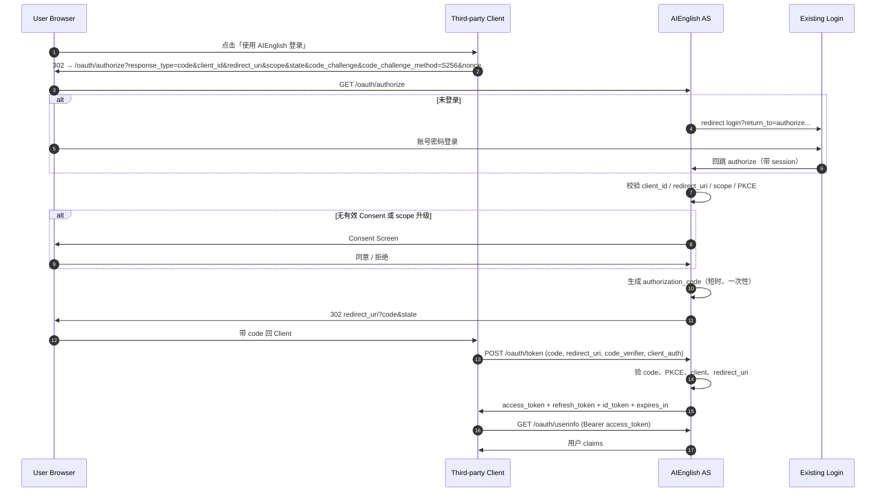
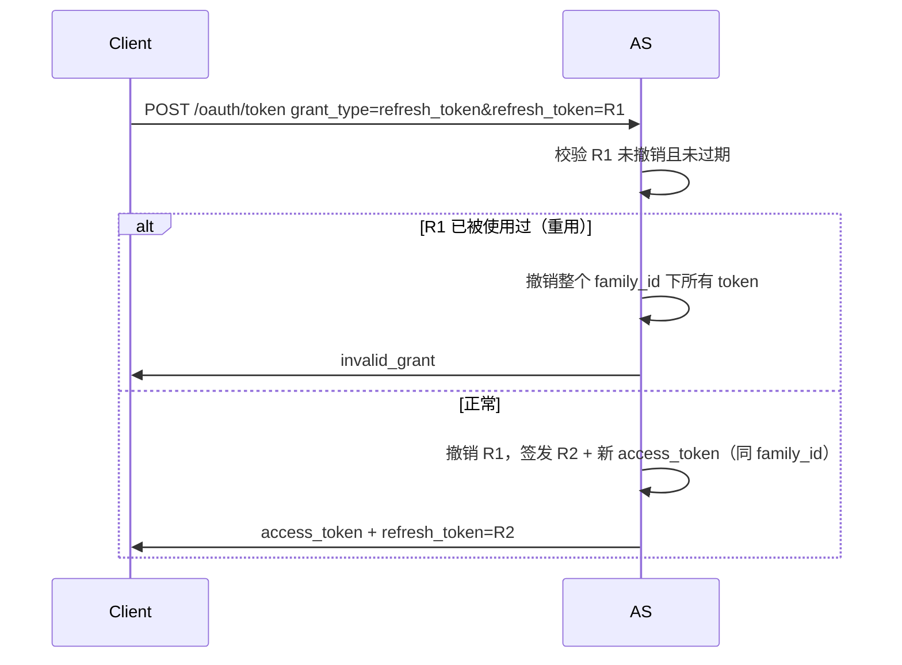
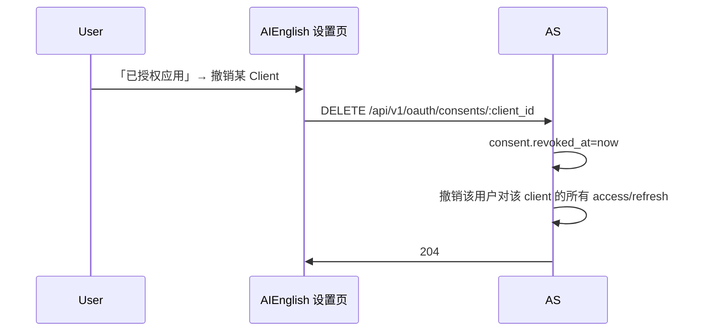

# AIEnglish OAuth 2.0 / OpenID Connect Identity Provider 技术设计文档

> 版本：v1.3  
> 日期：2026-08-26  
> 目标：将现有账号密码登录体系升级为可被第三方网站使用的标准身份提供方（IdP）  
> 现状依据：`DocAI_Backend_Rails`（Devise + `devise-jwt`，主体用户为 `general_users`）  
> Phase 1 代码：见 `docs/oauth_idp_phase1_handoff_2026_08_26_zh.md`

---

## 0. 已确认决策（全部锁定）

| # | 决策项 | 确认结果 |
|---|--------|----------|
| 1 | OAuth 用户主体 | **仅 `GeneralUser`**（`general_users`）。不接入 `users` 表 |
| 2 | Client 开通方式 | **仅管理端开通**。第三方不可自助注册；**Client 必须由管理员创建且 `enabled=true`（授权通过）后，才允许进入 `/oauth/authorize` 登录授权流程** |
| 3 | 学校隔离 | **不限制 `school_id`**。任意学校的 `GeneralUser` 均可被已开通 Client 授权登录（不做 Client↔学校绑定） |
| 4 | 技术选型 | **Doorkeeper + doorkeeper-openid_connect**（不自研协议核心） |
| 5 | Authorize / Consent 会话 | **HttpOnly Session Cookie**（AS 域；`SameSite=Lax`，生产 `Secure`）。不采用纯 JWT SPA 承载 Consent |
| 6 | Access Token | **Opaque**（DB 存 digest，本地查库校验）；**不**用 JWT 作为 access_token |
| 7 | ID Token | **JWT，RS256**；JWKS 暴露公钥 |
| 8 | PKCE | **所有 Client 强制 S256**（含 Confidential）；拒绝 `plain` |
| 9 | Refresh Token | **强制轮换（rotation）+ family 重用检测** |
| 10 | 交互式授权 | **仅 Authorization Code**；不实现 Implicit / ROPC |
| 11 | Consent / Authorize UI | **服务端授权页**（Doorkeeper views / 轻量前端挂在 `/oauth/*`），依赖 session，不依赖 localStorage JWT |

---

## 1. 总体架构说明

### 1.1 角色定义

```text
┌────────────────────┐         ┌──────────────────────────────┐
│  Third-party Site  │         │     AIEnglish IdP (本系统)     │
│  (OAuth Client)    │         │                              │
│                    │  1.Auth │  Authorization Server (AS)   │
│  App Backend/SPA ──┼────────►│  /oauth/authorize            │
│                    │◄────────┤  /oauth/token                │
│                    │  code   │  /oauth/revoke               │
│                    │         │  /.well-known/openid-config  │
│                    │  2.Tok  │                              │
│                    ├────────►│  Resource Server (RS)        │
│                    │◄────────┤  /oauth/userinfo             │
│                    │ claims  │  (未来可扩 API scopes)        │
└────────────────────┘         │                              │
                               │  Existing Auth               │
                               │  Devise + JWT (会话登录)      │
                               │  GeneralUser                 │
                               └──────────────────────────────┘
```

| 角色 | 本项目中的实体 | 职责 |
|------|----------------|------|
| **Resource Owner** | **仅 `GeneralUser`** | 拥有账号的终端用户（不使用 `User` 模型） |
| **Client** | 管理端开通的第三方应用 | 必须 `enabled=true` 才可发起授权登录 |
| **Authorization Server (AS)** | `DocAI_Backend_Rails` OAuth 模块 | 认证用户、发授权码/Token、Consent |
| **Resource Server (RS)** | 同后端的 `/oauth/userinfo`（及后续受保护 API） | 校验 Access Token，返回资源 |

> 说明：现有 **Devise JWT** 继续服务「用户直接登录 AIEnglish」场景；OAuth Token 与 Devise JWT **物理隔离**，不要混用同一密钥、同一表、同一过期策略。

### 1.2 与现有系统的集成方式

| 能力 | 现有实现 | OAuth IdP 集成点 |
|------|----------|------------------|
| 账号密码登录 | `POST /general_users/sign_in` + Devise JWT | Authorize 未登录时跳转现有登录页，登录成功回跳 `/oauth/authorize` |
| 会话凭证 | `Authorization: Bearer <devise-jwt>` / cookie | Consent / Authorize **必须**使用 AS 域 **HttpOnly session cookie**（与 API JWT 分离） |
| 用户资料 | `general_users.email/nickname/...` | UserInfo / `id_token` claims 映射 |
| 登出/吊销 | JwtDenylist | OAuth 另有 revoke + consent 撤销；密码修改应踢掉 OAuth refresh |

**已锁定会话模型（Authorize / Consent）：**

1. `/oauth/authorize` 与 Consent 为 **服务端流程**（Doorkeeper），依赖 **Rails session cookie**（`SameSite=Lax`，生产 `Secure` + `HttpOnly`）。
2. 未登录 → 跳转现有登录页 `/login?return_to=<authorize_url_encoded>`。
3. 登录成功时：除返回现有 Devise JWT 供产品 API 使用外，**同时建立 AS session**，再回跳 `return_to`。
4. 发码后：Confidential Client 用 **后端** 调 `/oauth/token`；Public Client 必须带 PKCE。

### 1.3 推荐协议能力矩阵

| 能力 | 是否必须 | 说明 |
|------|----------|------|
| Authorization Code | ✅ | 唯一推荐交互式登录授权方式 |
| PKCE (S256) | ✅ **全 Client 强制** | Public / Confidential 均要求 |
| Refresh Token | ✅ | **强制 rotation + 重用检测** |
| OpenID Connect | ✅ | `openid` scope → `id_token`（RS256） |
| Implicit / ROPC | ❌ | 不实现 |
| Client Credentials | 可选 Phase 4+ | 仅机器对机器，无用户 |

### 1.4 技术选型（已锁定）

**采用：Doorkeeper + doorkeeper-openid_connect**

- Authorization Code、PKCE、Refresh、Revoke、OIDC Discovery / UserInfo / JWKS 由 gem 提供，按产品规则配置。
- 与 Devise 共存：`resource_owner_authenticator` 解析当前 session 中的 `GeneralUser`。
- Admin 侧封装 `Doorkeeper::Application`（映射本文 `oauth_clients` 语义：`uid`/`secret`/`redirect_uri`/`scopes`/`enabled`）。
- Access Token 保持 Doorkeeper **opaque** 默认；`id_token` 由 OIDC 扩展签发。

> §2 表结构为语义说明；落地以 Doorkeeper / OIDC 迁移表为准（如 `oauth_applications`、`oauth_access_tokens` 等），字段语义对齐本文即可，无需再维护一套并行自研协议表。

---

## 2. 数据库设计

> 主体：`general_users.id` (UUID)。  
> 下列为 **语义模型**；实现采用 Doorkeeper 表名（例如 `oauth_applications` ≈ `oauth_clients`）。自定义字段（如 `enabled`、logo、隐私链接）通过扩展 application 表或 `meta`/关联表补齐。

### 2.1 现有 `general_users` 调整

**可不改表结构即可上线。** 建议可选增强：

| 变更 | 原因 |
|------|------|
| 无需新增登录字段 | OAuth 复用 `email` + `encrypted_password` |
| 可选：`meta['oauth']` 不推荐塞业务 | 授权关系应落独立表 |
| 密码变更 / 锁定时 hook | 撤销该用户全部 refresh / access（安全事件） |

UserInfo 可用字段映射：

| Claim | 来源 |
|-------|------|
| `sub` | `general_users.id`（稳定 UUID，永不复用） |
| `email` | `email` |
| `email_verified` | 若无独立验证字段，可先固定 `false` 或基于业务规则 |
| `name` / `nickname` | `nickname` |
| `phone_number` | `phone`（需 scope `phone`） |
| 自定义 | `school_id`, `banbie`, `class_no`（需自定义 scope） |

### 2.2 新增表

#### 2.2.1 `oauth_clients`（第三方应用注册）

| 字段 | 类型 | 说明 |
|------|------|------|
| `id` | uuid PK | |
| `name` | string not null | 应用显示名 |
| `uid` | string not null | **client_id**（对外） |
| `secret_digest` | string | **client_secret 哈希**（BCrypt）；Public Client 可空 |
| `confidential` | boolean default true | 是否机密客户端 |
| `redirect_uris` | text[] / jsonb not null | 允许的回调列表（精确匹配） |
| `scopes` | string default `'openid profile email'` | 客户端允许申请的最大 scope 集合 |
| `grant_types` | string[] | 如 `authorization_code`, `refresh_token` |
| `response_types` | string[] | 如 `code` |
| `token_endpoint_auth_method` | string | `client_secret_basic` / `client_secret_post` / `none` |
| `logo_url` | string | Consent 展示 |
| `homepage_url` | string | |
| `privacy_policy_url` | string | |
| `tos_url` | string | |
| `owner_type` / `owner_id` | 可选 | 内部创建人（管理员） |
| `trusted` | boolean default false | 受信应用可跳过二次 Consent（慎用；仍要求 `enabled=true`） |
| `enabled` | boolean default false | **须管理员显式启用（授权通过）后，才允许 `/oauth/authorize` 与发码** |
| `created_at` / `updated_at` | datetime | |

> **已确认：不设 `school_id`，不做 Client↔学校绑定。** 任意 `GeneralUser` 只要完成 Consent，均可被已启用 Client 授权。

**索引：**

- UNIQUE(`uid`)
- INDEX(`enabled`)

#### 2.2.2 `oauth_authorization_codes`

| 字段 | 类型 | 说明 |
|------|------|------|
| `id` | uuid PK | |
| `code_digest` | string not null | 授权码哈希存储（库中不存明文） |
| `oauth_client_id` | uuid FK | |
| `general_user_id` | uuid FK | |
| `redirect_uri` | string not null | 发码时绑定，换 token 必须一致 |
| `scopes` | string not null | 实际授权 scope |
| `code_challenge` | string | PKCE |
| `code_challenge_method` | string | `S256`（仅允许 S256） |
| `nonce` | string | OIDC |
| `auth_time` | datetime | 用户认证时间（ACR/认证时间 claim） |
| `expires_at` | datetime not null | 建议 5–10 分钟 |
| `used_at` | datetime | 一次性；使用后标记 |
| `revoked_at` | datetime | |
| `created_at` | datetime | |

**索引：**

- UNIQUE(`code_digest`)
- INDEX(`expires_at`)
- INDEX(`oauth_client_id`, `general_user_id`)

#### 2.2.3 `oauth_access_tokens`

| 字段 | 类型 | 说明 |
|------|------|------|
| `id` | uuid PK | |
| `token_digest` | string not null | access token 哈希 |
| `oauth_client_id` | uuid FK | |
| `general_user_id` | uuid FK | resource owner |
| `scopes` | string not null | |
| `expires_at` | datetime not null | 建议 15m–1h |
| `revoked_at` | datetime | |
| `oauth_refresh_token_id` | uuid null | 关联签发链路 |
| `created_at` | datetime | |

**索引：**

- UNIQUE(`token_digest`)
- INDEX(`general_user_id`)
- INDEX(`expires_at`)
- INDEX(`oauth_client_id`, `general_user_id`)

#### 2.2.4 `oauth_refresh_tokens`

| 字段 | 类型 | 说明 |
|------|------|------|
| `id` | uuid PK | |
| `token_digest` | string not null | |
| `oauth_client_id` | uuid FK | |
| `general_user_id` | uuid FK | |
| `scopes` | string not null | |
| `expires_at` | datetime not null | 建议 30–90 天 |
| `revoked_at` | datetime | |
| `replaced_by_id` | uuid null | rotation 后指向新 refresh |
| `family_id` | uuid not null | 同一登录族；重用检测用 |
| `created_at` | datetime | |

**索引：**

- UNIQUE(`token_digest`)
- INDEX(`family_id`)
- INDEX(`general_user_id`)
- INDEX(`expires_at`)

#### 2.2.5 `oauth_user_consents`（用户授权记录）

| 字段 | 类型 | 说明 |
|------|------|------|
| `id` | uuid PK | |
| `general_user_id` | uuid FK | |
| `oauth_client_id` | uuid FK | |
| `scopes` | string not null | 已同意的 scope 并集或精确集合 |
| `granted_at` | datetime | |
| `revoked_at` | datetime | 用户撤销 |
| `created_at` / `updated_at` | | |

**索引：**

- UNIQUE(`general_user_id`, `oauth_client_id`) WHERE `revoked_at IS NULL`（或部分唯一）
- INDEX(`oauth_client_id`)

#### 2.2.6 `oauth_oidc_keys`（可选，JWT 签名密钥轮换）

| 字段 | 类型 | 说明 |
|------|------|------|
| `id` | uuid | |
| `kid` | string unique | JWKS key id |
| `algorithm` | string | `RS256` 推荐 |
| `private_key_pem_encrypted` | text | KMS/凭据加密存储 |
| `public_key_pem` | text | 可公开 |
| `active` | boolean | 当前签名钥 |
| `expires_at` | datetime | 轮换窗口 |

> 小流量也可先用 ENV 中 RSA 私钥 + 静态 JWKS；密钥表便于无停机轮换。

#### 2.2.7 `oauth_audit_logs`（强烈建议）

| 字段 | 说明 |
|------|------|
| `event` | `authorize_success` / `token_issued` / `token_refresh` / `revoke` / `consent_deny` / `refresh_reuse_detected` |
| `oauth_client_id` / `general_user_id` | |
| `ip` / `user_agent` | |
| `meta` jsonb | 无敏感 token 明文 |
| `created_at` | |

### 2.3 ER 关系（简图）

```text
general_users 1───* oauth_user_consents *───1 oauth_clients
general_users 1───* oauth_authorization_codes
general_users 1───* oauth_access_tokens
general_users 1───* oauth_refresh_tokens
oauth_clients 1───* (codes / tokens / consents)
```

---

## 3. 核心流程时序

### 3.1 Authorization Code + PKCE + OIDC



### 3.2 Token 刷新（强制 Rotation）



### 3.3 用户撤销授权



Client 侧主动注销：

```http
POST /oauth/revoke
token=...&token_type_hint=refresh_token
```

---

## 4. API 接口设计

### 4.1 Discovery（推荐）

`GET /.well-known/openid-configuration`

```json
{
  "issuer": "https://api.example.com",
  "authorization_endpoint": "https://api.example.com/oauth/authorize",
  "token_endpoint": "https://api.example.com/oauth/token",
  "userinfo_endpoint": "https://api.example.com/oauth/userinfo",
  "jwks_uri": "https://api.example.com/oauth/jwks",
  "revocation_endpoint": "https://api.example.com/oauth/revoke",
  "response_types_supported": ["code"],
  "subject_types_supported": ["public"],
  "id_token_signing_alg_values_supported": ["RS256"],
  "scopes_supported": ["openid", "profile", "email", "offline_access"],
  "token_endpoint_auth_methods_supported": [
    "client_secret_basic",
    "client_secret_post",
    "none"
  ],
  "code_challenge_methods_supported": ["S256"],
  "grant_types_supported": ["authorization_code", "refresh_token"]
}
```

`GET /oauth/jwks` → 公钥 JWKS。

### 4.2 管理端：Client CRUD

鉴权：Admin / SuperAdmin（现有后台角色）。  
**业务规则（已确认）：仅管理端可创建 Client；创建后须 `enabled=true`（授权通过）才可被第三方用于登录。未启用的 `client_id` 访问 `/oauth/authorize` 或 `/oauth/token` 一律拒绝。**

#### 创建 Client

`POST /api/admin/v1/oauth/clients`

```json
{
  "name": "Partner Portal",
  "confidential": true,
  "redirect_uris": ["https://partner.example.com/oauth/callback"],
  "scopes": "openid profile email offline_access",
  "logo_url": "https://partner.example.com/logo.png",
  "enabled": false
}
```

> 建议默认 `enabled=false`，管理员复核 redirect_uri / 商务协议后再 `PATCH enabled=true`。

响应（**secret 仅创建时返回一次**）：

```json
{
  "id": "…",
  "client_id": "aieng_abc123",
  "client_secret": "plain_secret_only_once",
  "redirect_uris": ["https://partner.example.com/oauth/callback"],
  "scopes": "openid profile email offline_access"
}
```

#### 列表 / 更新 / 禁用 / 启用

- `GET /api/admin/v1/oauth/clients`
- `PATCH /api/admin/v1/oauth/clients/:id`（可改名称、redirect_uris、scopes）
- `POST /api/admin/v1/oauth/clients/:id/rotate_secret`
- `PATCH /api/admin/v1/oauth/clients/:id` with `{ "enabled": true }` → **授权通过，允许登录**
- `PATCH ... { "enabled": false }` → 立即拒绝新的 authorize/token；建议同时撤销该 Client 下未过期 refresh

### 4.3 标准端点：Authorize

`GET /oauth/authorize`

| 参数 | 必填 | 说明 |
|------|------|------|
| `response_type` | 是 | 仅 `code` |
| `client_id` | 是 | |
| `redirect_uri` | 是 | 必须在白名单**精确匹配** |
| `scope` | 是 | 空格分隔；含 `openid` 才发 id_token |
| `state` | 强烈建议 | CSRF，原样回传 |
| `code_challenge` | **是** | 全 Client 强制 PKCE |
| `code_challenge_method` | **是** | 仅 `S256` |
| `nonce` | OIDC 强烈建议 | 写入 id_token |
| `prompt` | 可选 | `none` / `login` / `consent` |
| `login_hint` | 可选 | 预填邮箱 |

**成功：** `302` → `redirect_uri?code=...&state=...`  
**拒绝：** `redirect_uri?error=access_denied&state=...`  
**Client 未启用时：** 返回 AS 错误页或 `unauthorized_client`（**不得**将用户重定向到未登记/不可信 redirect）。

### 4.4 标准端点：Token

`POST /oauth/token`  
`Content-Type: application/x-www-form-urlencoded`

#### 换码

```text
grant_type=authorization_code
&code=...
&redirect_uri=https://partner.example.com/oauth/callback
&client_id=aieng_abc123
&client_secret=...
&code_verifier=...
```

响应：

```json
{
  "access_token": "at_...",
  "token_type": "Bearer",
  "expires_in": 900,
  "refresh_token": "rt_...",
  "scope": "openid profile email offline_access",
  "id_token": "eyJhbGciOiJSUzI1NiIsInR5cCI6IkpXVCJ9..."
}
```

#### 刷新

```text
grant_type=refresh_token
&refresh_token=rt_...
&client_id=...
&client_secret=...
```

### 4.5 UserInfo

`GET /oauth/userinfo`  
`Authorization: Bearer <access_token>`

```json
{
  "sub": "550e8400-e29b-41d4-a716-446655440000",
  "email": "student@school.edu",
  "email_verified": false,
  "name": "Amy",
  "nickname": "Amy",
  "updated_at": 1730000000
}
```

按 scope 裁剪字段；无相应 scope 不返回敏感 claim。

### 4.6 Revoke

`POST /oauth/revoke`

```text
token=rt_...
&token_type_hint=refresh_token
&client_id=...
&client_secret=...
```

按 RFC 7009：未知 token 也返回 200（防探测），但需做 client 鉴权。

### 4.7 用户侧：已授权应用

（需登录 Devise/session）

- `GET /api/v1/oauth/consents` → 列表
- `DELETE /api/v1/oauth/consents/:client_id` → 撤销

### 4.8 错误码设计

遵循 RFC 6749 / OIDC Core：

| error | 场景 | HTTP |
|-------|------|------|
| `invalid_request` | 缺参、重复参 | 400 |
| `unauthorized_client` | 客户端无权用此 grant | 400/401 |
| `access_denied` | 用户拒绝 | 302 回 redirect |
| `unsupported_response_type` | 非 code | 400 或错误页 |
| `invalid_scope` | scope 非法/超授权 | 400 |
| `server_error` | 内部错误 | 500 |
| `temporarily_unavailable` | 过载 | 503 |
| `invalid_client` | 密钥错误 | 401 |
| `invalid_grant` | code/refresh 无效、过期、PKCE 失败、重用 | 400 |
| `unsupported_grant_type` | | 400 |
| `login_required` | `prompt=none` 但未登录 | 302 error |
| `consent_required` | `prompt=none` 需同意 | 302 error |

示例：

```json
{
  "error": "invalid_grant",
  "error_description": "Authorization code expired or already used"
}
```

---

## 5. Scope 设计建议

### 5.1 标准基础 Scope

| Scope | 含义 | 释放的数据 |
|-------|------|------------|
| `openid` | OIDC 必需 | `sub` + `id_token` |
| `profile` | 基本资料 | `name`, `nickname`, `updated_at`… |
| `email` | 邮箱 | `email`, `email_verified` |
| `phone` | 手机 | `phone_number`（若开放） |
| `offline_access` | 刷新令牌 | 是否签发 refresh_token |

### 5.2 业务自定义 Scope（示例）

| Scope | 说明 | 注意 |
|-------|------|------|
| `school` | `school_id` 及学校只读信息 | 教育合规 |
| `class_profile` | `banbie`, `class_no` | 未成年人场景慎开 |
| `aienglish.read_progress` | 未来：学习进度只读 API | Resource API 另鉴权 |

**扩展原则：**

1. Client 注册时配置 **允许的最大 scope**。
2. 用户 Consent 展示 **人类可读说明**（i18n）。
3. Access Token 内（或 DB）记录最终 granted scopes；UserInfo / API 按交集鉴权。
4. Scope 升级必须重新 Consent。

---

## 6. 安全设计重点

### 6.1 PKCE（已锁定：全强制）

- **所有 Client（Public 与 Confidential）强制** `code_challenge_method=S256`。
- 拒绝 `plain`；缺 PKCE 参数则 `invalid_request`。

### 6.2 redirect_uri

- 仅 **精确字符串匹配**（含 path、query 有无都算不同）。
- 禁止通配符、禁止 `localhost` 进入生产白名单（开发环境可分 env 配置）。
- 禁止 `javascript:` / 非 https（本地调试例外）。

### 6.3 Token 安全

| 项 | 要求 |
|----|------|
| 存储 | DB 只存 **SHA-256/HMAC digest**，响应中给一次明文 |
| 传输 | 仅 HTTPS；禁止 URL fragment 传 refresh |
| Access TTL | 15–60 分钟 |
| Refresh TTL | 30–90 天 + **每次刷新轮换** |
| 重用检测 | 旧 refresh 再出现 → 作废整个 `family_id` |
| 与 Devise JWT | 不同 secret、不同前缀（`at_`/`rt_`）、不同表 |

### 6.4 防 CSRF / 开放重定向

- 必须使用并校验 `state`（Client 侧绑定 session）。
- Authorize 错误时：仅当 `redirect_uri` 预注册且合法才 302；否则 AS 错误页。
- Consent 提交带 **CSRF token**（Rails authenticity_token）。

### 6.5 防重放

- Authorization code：**一次性** + 短 TTL。
- `nonce` 写入 `id_token`，Client 校验。
- `id_token`：`iss`/`aud`/`exp`/`iat`/`auth_time` 完整校验文档提供给对接方。

### 6.6 密钥与证书

- `id_token` 使用 **RS256**（非 HS256 共享密钥）。
- 私钥放 KMS / Rails credentials / 密封 ENV；JWKS 暴露公钥。
- 至少每年轮换；轮换时 JWKS 同时保留上一把 `kid` 直至 JWT 过期。
- `client_secret` 仅存 digest；泄露即 rotate。

### 6.7 其它

- 速率限制：`/oauth/token`、`/oauth/authorize` 按 IP + client_id。
- 安全头：`Cache-Control: no-store` 用于 token 响应。
- 审计日志不可落 token 明文。
- 用户改密 / 锁定：触发 refresh 族撤销。

---

## 7. 前端授权页面（Consent）设计要点

### 7.1 必须展示

1. 第三方应用 **名称 + Logo + 主页**
2. 申请访问的权限列表（scope → 文案）
3. 当前登录用户标识（邮箱脱敏）
4. 「不是你？切换账号」
5. 隐私政策 / 服务条款链接（Client 配置）
6. 明确按钮：**允许** / **拒绝**

### 7.2 交互流程

```text
进入 Authorize
  → 校验 query（失败则错误页）
  → 未登录 → Login + return_to
  → 已登录
      → trusted client 且 scopes 已被 consent 覆盖 → 直接发码
      → 否则展示 Consent
          → 允许 → 写/更新 consent → 发码 → redirect
          → 拒绝 → redirect error=access_denied
```

### 7.3 UX 注意

- 避免诱导性文案；权限最小化默认勾选（不可静默扩大）。
- 移动端单列布局；按钮防重复提交。
- 支持中英（至少与产品一致）。

---

## 8. 与现有登录系统的兼容方案

### 8.1 已登录用户

- Authorize / Consent 只认 **AS 域 HttpOnly session**，不认 localStorage 里的 Devise JWT。
- 用户若已持有产品 API JWT 但无 AS session：视为未登录，走登录页并在成功后建立 session，再回 `return_to`。

**落地要求：** 登录成功除返回 Devise JWT 外，必须在 AS 域设置 session cookie，供 `/oauth/authorize` 使用。

### 8.2 未登录用户

```text
/oauth/authorize
  → 302 /login?return_to=https%3A%2F%2Fapi...%2Foauth%2Fauthorize%3F...
  → 用户密码登录（现有 normalForm / Devise）
  → 登录成功校验 return_to 仅允许本站 /oauth/authorize 开头
  → 302 回 authorize 继续
```

### 8.3 与学校学生专属登录页

已有「学生专属登入页」（slug + email domain）时，仅作为 **GeneralUser 登录入口之一**：

- `login_hint` / `return_to` 可带到学校登录页。
- 登录完成后同样回到 `/oauth/authorize`。
- **已确认：不按 `school_id` 限制 Client。** 不校验「用户学校是否匹配某 Client」。

### 8.4 双 Token 体系并存

| 场景 | 使用凭证 |
|------|----------|
| 用户使用 AIEnglish 产品 API | 现有 Devise JWT |
| 第三方代表用户读 UserInfo | OAuth Access Token |
| 第三方长期会话 | OAuth Refresh Token |

禁止用 OAuth access_token 直接当 Devise JWT 调全部业务 API（除非显式做 scope 网关）。

---

## 9. 实施步骤建议

### Phase 1：基础 Authorization Code + Token（约 1–2 周）

- [x] 引入 **Doorkeeper**；`resource_owner_authenticator` → **仅 GeneralUser**（session）
- [x] 配置强制 PKCE（S256）、Authorization Code + Refresh；opaque access token
- [x] Client 管理（Admin CRUD over `OauthApplication`；secret 一次性展示；**默认未启用，启用后才可授权登录**）
- [x] 登录成功建立 **HttpOnly AS session**；`/oauth/authorize` + `return_to` 白名单；`POST /oauth/session` 桥接
- [x] `/oauth/token`（code 交换）+ refresh（`previous_refresh_token` 轮换）
- [x] 拒绝 `enabled=false` 的 client
- [x] 基础审计日志（`oauth_audit_logs`）
- [ ] 对接一份内部 Demo Client 跑通（需本地 `bundle install` + migrate 后手工验收）

**落地说明：** `docs/oauth_idp_phase1_handoff_2026_08_26_zh.md`

**验收：** 第三方用 code 流程拿到 access_token；code 重放失败；PKCE 错误失败。

### Phase 2：OpenID Connect + UserInfo（约 1 周）

- [ ] 启用 **doorkeeper-openid_connect**
- [ ] `openid` scope → 签发 `id_token`（**RS256**）
- [ ] `/.well-known/openid-configuration` + `/oauth/jwks`
- [ ] `/oauth/userinfo`
- [ ] `nonce` / `auth_time` 等 claim
- [ ] 提供对接文档（校验清单）

**验收：** OIDC Debugger / 标准库校验 id_token 通过。

### Phase 3：Consent + 用户授权管理 + 管理后台完善（约 1 周）

- [ ] Consent UI（scope 文案 i18n）
- [ ] `oauth_user_consents` + 撤销 API + 产品「已授权应用」页
- [ ] `/oauth/revoke`
- [ ] Admin：启用/禁用 Client、重定向 URI 变更审计
- [ ] 密码修改撤销 refresh

**验收：** 用户撤销后旧 refresh 立即失效。

### Phase 4：安全加固与监控（持续）

- [ ] 速率限制与 WAF 规则
- [ ] refresh 重用告警
- [ ] 密钥轮换演练
- [ ] 可选：Client Credentials、Token Introspection
- [ ] 可选：自定义业务 scope + Resource API（**不做学校维度 Client 隔离**）
- [ ] 渗透测试 / OAuth 安全 checklist

---

## 10. 注意事项与常见坑

1. **混用 Devise JWT 与 OAuth Token**  
   寿命、吊销、受众（aud）不同，混用会导致无法精确撤销或越权。

2. **redirect_uri 模糊匹配**  
   是经典账号劫持漏洞来源；必须精确匹配。

3. **授权码不绑定 client + redirect_uri + code_verifier**  
   code 泄露即可被换 token。

4. **Refresh 不轮换**  
   泄露后长期有效；必须 rotation + reuse detection。

5. **把 client_secret 放进 SPA**  
   SPA 只能是 Public Client + PKCE，`token_endpoint_auth_method=none`。

6. **Consent 只做一次后永久扩大 scope**  
   新增 scope 必须重新同意。

7. **`prompt=none` 实现不完整**  
   未登录/未同意时应按 OIDC 返回 `login_required` / `consent_required`，不要静默发码。

8. **错误时把用户重定向到攻击者 URI**  
   校验失败不要 302 到请求里的 redirect_uri。

9. **日志打印 code/token**  
   禁止；仅 log id / digest 前缀。

10. **`sub` 使用邮箱**  
    邮箱可变；必须用稳定 `general_users.id`。

11. **CORS**  
    `/oauth/token` 若允许浏览器直调，需严格 Origin；机密客户端应服务器间调用。

12. **时钟偏移**  
    `id_token` 校验允许少量 clock skew（如 60s），并在对接文档写明。

13. **未成年人 / 学校数据**  
    自定义 scope 涉及班级信息时需合规评估与学校授权。

14. **Doorkeeper 默认表名与文档差异**  
    实施时以 gem 迁移为准，保持语义映射，勿死磕表名。

---

## 11. 第三方对接最小清单（可对外发布）

1. 向管理员申请 `client_id` / `client_secret` / 登记 `redirect_uri`。
2. 引导用户至：

```text
GET {issuer}/oauth/authorize
  ?response_type=code
  &client_id=...
  &redirect_uri=...
  &scope=openid%20profile%20email%20offline_access
  &state={random}
  &code_challenge={S256(challenge)}
  &code_challenge_method=S256
  &nonce={random}
```

3. 回调收取 `code`，后端：

```text
POST {issuer}/oauth/token
```

4. 校验 `id_token`（签名、iss、aud、nonce、exp）。
5. （可选）`GET /oauth/userinfo`。
6. 用 `refresh_token` 续期；安全退出时调用 `/oauth/revoke`。

---

## 12. 模块划分（Rails + Doorkeeper）

```text
Gemfile
  doorkeeper
  doorkeeper-openid_connect

config/initializers/doorkeeper.rb          # grant types, PKCE, TTL, resource_owner_authenticator
config/initializers/doorkeeper_openid_connect.rb

app/controllers/
  api/admin/v1/oauth/clients_controller.rb # 封装 Doorkeeper::Application + enabled
  api/v1/oauth/consents_controller.rb      # 用户撤销已授权应用
  # authorize / token / userinfo / revoke / discovery：Doorkeeper & OIDC 路由

app/views/doorkeeper/                     # Consent / 错误页定制
app/services/oauth/
  application_enabler.rb                  # enabled 门禁
  return_to_validator.rb
  session_establisher.rb                  # 登录成功写 AS session
```

`resource_owner_authenticator` 伪代码：

```ruby
resource_owner_authenticator do
  general_user = current_general_user_from_session
  if general_user
    general_user
  else
    session[:return_to] = request.fullpath
    redirect_to login_url(return_to: request.fullpath)
  end
end
```

---

## 13. 结论与下一步

本方案把 AIEnglish 现有 **GeneralUser + Devise 登录** 升级为标准 **OAuth 2.0 Authorization Code (+PKCE) + OIDC IdP**，与现有 API JWT 并存、职责分离。

### 已全部锁定

| 项 | 选择 |
|----|------|
| Subject | 仅 `GeneralUser` |
| Client | 管理端开通；`enabled=true` 才可授权登录 |
| 学校 | 不限制 `school_id` |
| 实现 | **Doorkeeper + doorkeeper-openid_connect** |
| Consent 会话 | **HttpOnly Session** |
| Access Token | Opaque |
| ID Token | JWT RS256 |
| PKCE | 全 Client 强制 S256 |
| Refresh | 强制 rotation + 重用检测 |

**下一步：** 直接进入 Phase 1（装 gem、配置 Doorkeeper、Admin 启用 Client、登录写 session、跑通 Demo 回调）。

---

## 附录 A：id_token Claims 示例

```json
{
  "iss": "https://api.example.com",
  "sub": "550e8400-e29b-41d4-a716-446655440000",
  "aud": "aieng_abc123",
  "exp": 1730000900,
  "iat": 1730000000,
  "auth_time": 1730000000,
  "nonce": "n-0S6_WzA2Mj",
  "email": "student@school.edu",
  "name": "Amy"
}
```

> 仅在请求了对应 scope 时于 id_token 放 profile/email（也可只放 `sub`，详情走 UserInfo，更灵活）。

## 附录 B：与「学生专属登入页」的衔接示意

```text
Partner → /oauth/authorize（client 须已 enabled）
  → 未登录 → /s/{school_slug}/login?return_to=...   # 仅登录入口，不校验学校与 Client 绑定
  → 学生输入 local-part + 固定 domain → GeneralUser session
  → return_to=/oauth/authorize?...
  → Consent → code → Partner
```
