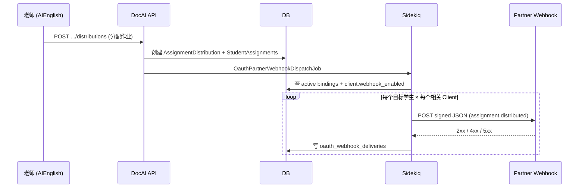

# OAuth 第三方账号绑定统计与作业推送实施方案

> **版本**：v1.1  
> **日期**：2026-08-27  
> **状态**：开发中（AIEnglish 后台 + 管理后台 Phase A/B/C 出站侧）  
> **当前范围**：仅 `DocAI_Backend_Rails` + `AIEnglish_Admin_Dashboard_Frontend`；**暂不同步 To-Do-Share-AI 改造**（Partner 接收端延后）  
> **适用范围**：`DocAI_Backend_Rails`（IdP / AS）、`AIEnglish_Admin_Dashboard_Frontend`（平台管理端）、第三方 OAuth Client（如 `To-Do-Share-AI`）  
> **前置依赖**：OAuth Phase 1 已落地（Doorkeeper、`oauth_applications`、Admin Client CRUD、`/oauth/revoke_binding` 等，见 `docs/oauth_idp_phase1_handoff_2026_08_26_zh.md`）

---

## 0. 文档目的

在 **第三方网站已可通过 AIEnglish 账号 OAuth 登录** 的基础上，补齐以下三类能力，并形成可分期交付、可验收的产品与技术方案：

| # | 需求摘要 | 本文章节 |
|---|----------|----------|
| 1 | 管理后台查看每个第三方项目有多少账号通过 AIEnglish 登录，并记录**来源网站**与**第三方账号 ID** | §3、§5、§8 Phase A |
| 2 | 老师分配 Assignment 时，向已绑定且启用推送的第三方网站推送作业消息；管理后台可配置是否启用推送及 Webhook API | §4、§5、§8 Phase B/C |
| 3 | 第三方网站如何接收、验签、入库与展示推送消息的规划 | §6、§7、§8 Phase D |

---

## 1. 背景与现状

### 1.1 已完成（Phase 1）

```text
第三方网站                    AIEnglish IdP (DocAI_Backend_Rails)
     │                              │
     │  Authorization Code + PKCE   │
     ├─────────────────────────────►│ /oauth/authorize
     │                              │ /oauth/token
     │◄─────────────────────────────┤ /oauth/userinfo  (sub = general_users.id)
     │                              │
     │  本地 session + 映射 sub      │  oauth_applications (Admin 开通)
     │                              │  oauth_access_tokens / grants
     │                              │  oauth_audit_logs (部分事件)
```

- **用户主体**：`GeneralUser`（`general_users.id` = UserInfo `sub`）
- **Client 管理**：`GET/POST /api/admin/v1/oauth/clients` + Admin 前端 `OauthClientsPanel`
- **解绑演示**：`POST /oauth/revoke_binding`（吊销 token/grant + 审计）
- **作业体系**：`EssayAssignment` → `AssignmentDistribution` → `AssignmentStudentAssignment`（与 OAuth **尚未关联**）

### 1.2 关键缺口（本方案要补）

| 缺口 | 影响 |
|------|------|
| 无「账号绑定」持久化表 | 无法稳定展示「第三方账号 ID」；解绑后无法区分历史绑定 |
| 审计未完整写入 `token_issued` / `authorize_success` | 登录次数统计不准确 |
| `oauth_applications` 无 Webhook 配置 | 无法按 Client 启用/关闭推送 |
| 作业分发无 Partner 出站事件 | 第三方看不到新 Assignment |
| 第三方解绑多仅清本地 meta（如 To-Do-Share-AI） | IdP 与 Partner 绑定状态不一致 |
| 无 Webhook 投递、重试、验签规范 | 无法可靠推送 |

### 1.3 关联文档

| 文档 | 关系 |
|------|------|
| `docs/oauth_oidc_identity_provider_design_2026_08_26_zh.md` | IdP 总体设计 |
| `docs/AIEnglish OAuth 账号登录对接文档.md` | 第三方 OAuth 登录对接（本方案为其 **Phase 2 扩展**） |
| `docs/assignment_task_2_distribution.md` | 作业分发模型 |
| `docs/assignment_task_6_background_jobs.md` | 分发通知 Job（邮件；可复用 Sidekiq 模式） |
| `To-Do-Share-AI/docs/2.0/09_AI_English_Connector.md` | 首个 Partner 的作业同步愿景（Inbound Todo）；本方案补 **Outbound Webhook** |

---

## 2. 术语与角色

| 术语 | 定义 |
|------|------|
| **OAuth Client / 第三方项目** | `oauth_applications` 一条记录，如 To-Do-Share-AI、Essay Admin |
| **来源网站** | Client 登记的 `homepage_url` 或 Partner 上报的 `external_site`（站点 Origin） |
| **AIEnglish 账号** | `GeneralUser`，UserInfo `sub` |
| **第三方账号 ID** | Partner 侧用户主键（如 Supabase `users.id`、自研 `user_id`），由 Partner 在绑定完成时上报 |
| **账号绑定** | 某 `general_user_id` 与某 `oauth_application_id` 下某 `external_user_id` 的关联关系 |
| **作业推送** | AIEnglish 在作业生命周期事件发生时，向 Partner 配置的 HTTPS Webhook URL 发送 signed JSON |
| **平台管理员** | 使用 Admin Dashboard + `ADMIN_TOKEN` 管理 OAuth Client 与推送配置 |
| **Partner 开发者** | 第三方网站后端，实现 Webhook 接收端与本地展示 |

---

## 3. 需求一：管理后台 — 第三方登录账号统计

### 3.1 业务目标

平台管理员在 **OAuth 应用详情/列表** 中能看到：

1. **绑定账号总数**（当前有效绑定）
2. **历史累计授权用户数**（曾成功完成 OAuth 登录/发 token 的去重用户数）
3. **最近 7/30 天活跃绑定用户**（有 token 刷新或新授权）
4. **绑定明细列表**（可分页、可导出）：
   - AIEnglish 用户 ID（`sub` / `general_user_id`）
   - 邮箱（脱敏可选）、昵称
   - **来源网站**（`homepage_url` 或 Partner 上报域名）
   - **第三方账号 ID**（`external_user_id`）
   - 首次绑定时间、最近活跃时间、当前状态（active / revoked）

### 3.2 统计口径（锁定）

| 指标 | 计算方式 | 备注 |
|------|----------|------|
| 当前绑定数 | `oauth_partner_account_links.status = active` 计数 | 以绑定表为准，非 token 表 |
| 累计授权用户 | `oauth_audit_logs` 中 `event IN (token_issued, authorize_success)` 按 `general_user_id` 去重 | 需补 audit hook |
| 今日新增绑定 | `oauth_partner_account_links.linked_at` 当天 | |
| 已解绑数 | `status = revoked` | |

> **说明**：仅统计 **enabled Client** 下的数据；disable Client 后不再新增绑定，历史数据保留。

### 3.3 Admin API（草案）

**列表汇总**

```http
GET /api/admin/v1/oauth/clients
```

在现有 `data[]` 每项增加：

```json
{
  "id": 1,
  "name": "To-Do-Share-AI",
  "client_id": "abc...",
  "enabled": true,
  "stats": {
    "active_bindings": 128,
    "total_authorized_users": 340,
    "active_last_7d": 45,
    "revoked_bindings": 12
  }
}
```

**绑定明细分页**

```http
GET /api/admin/v1/oauth/clients/:id/account_links?page=1&per_page=20&status=active|revoked|all
```

响应：

```json
{
  "status": "success",
  "data": {
    "items": [
      {
        "id": "uuid",
        "general_user_id": "uuid",
        "email_masked": "z***@example.com",
        "nickname": "张三",
        "external_user_id": "partner-user-9981",
        "external_site": "https://todo.example.com",
        "status": "active",
        "linked_at": "2026-08-20T10:00:00Z",
        "last_active_at": "2026-08-27T08:00:00Z",
        "revoked_at": null
      }
    ],
    "pagination": { "page": 1, "per_page": 20, "total": 128 }
  }
}
```

**导出（可选 Phase A+）**

```http
GET /api/admin/v1/oauth/clients/:id/account_links/export.csv
```

### 3.4 Admin 前端（草案）

| 页面/组件 | 功能 |
|-----------|------|
| `OauthClientsPanel` | 列表增加绑定数、7 日活跃列 |
| `OauthClientDetailPage`（新建） | Tab：基本信息 / 账号绑定 / 推送配置 / 投递日志 |
| `OauthAccountLinksTable` | 明细表 + 状态筛选 + 搜索（邮箱、external_user_id） |

### 3.5 验收标准（需求一）

- [ ] 每个 OAuth Client 列表页可见 `active_bindings` 与 `active_last_7d`
- [ ] 详情页可分页查看绑定明细，含 **来源网站** 与 **第三方账号 ID**
- [ ] 用户完成 OAuth 登录且 Partner 上报绑定后，24h 内 Admin 可见新记录
- [ ] 用户调用 `revoke_binding` 或 Admin disable Client 后，绑定状态变为 `revoked`，统计随之更新
- [ ] 累计授权用户数与 audit 日志抽样一致（误差 0）

---

## 4. 需求二：作业 Assignment 推送到第三方

### 4.1 业务场景（澄清与锁定）

原需求中「登录并解绑」按产品语义修正为：

> **当老师向学生分配 Assignment 时，若该学生存在针对某第三方 Client 的有效账号绑定，且该 Client 已在管理后台启用推送，则 AIEnglish 向 Partner Webhook 推送作业事件。**

并行补充以下场景（同一 Webhook 通道）：

| 场景 | 事件 | 是否 Phase 2 必须 |
|------|------|---------------------|
| 老师新建分发 / 追加学生 | `assignment.distributed` | ✅ 必须 |
| 修改 deadline / 撤回分发 | `assignment.updated` / `assignment.withdrawn` | ✅ 必须 |
| 用户解绑 OAuth | `oauth.binding.revoked` | ✅ 必须（Partner 清理本地关联） |
| 首次 OAuth 绑定成功 | `oauth.binding.created` | 建议 |
| 提醒通知 | `assignment.reminder` | 可选（Phase 2+） |

**解绑与作业的关系**：

- 解绑 **不删除** AIEnglish 内作业数据
- 解绑后 **不再推送** 新作业给该 Partner 下此用户的 mapping
- Partner 收到 `oauth.binding.revoked` 后应：标记本地关联失效、隐藏/归档未完成的同步 Todo（产品规则由 Partner 自定）

### 4.2 触发链路



**匹配规则**：

1. 取分发涉及的全部 `general_user_id`
2. 查 `oauth_partner_account_links` where `status=active`
3. 按 `oauth_application_id` 分组
4. 仅对 `webhook_enabled=true` 且 `webhook_url` 有效的 Client 投递
5. 同一 `(event_id)` 幂等，Partner 重复收到应安全忽略

### 4.3 管理后台 — 推送配置

在 OAuth Client 上扩展字段（推荐独立表，便于轮换 secret 与历史）：

**表 `oauth_application_webhooks`**（1:1 Client）

| 字段 | 类型 | 说明 |
|------|------|------|
| `oauth_application_id` | bigint PK/FK | |
| `enabled` | boolean | 是否启用出站推送，默认 `false` |
| `url` | string | HTTPS Webhook URL |
| `signing_secret` | string | HMAC 密钥（Admin 创建时生成，仅展示一次） |
| `subscribed_events` | jsonb | 默认 `["assignment.*", "oauth.binding.*"]` |
| `timeout_seconds` | integer | 默认 10 |
| `max_retries` | integer | 默认 5 |
| `custom_headers` | jsonb | 可选固定 Header（不含 secret） |
| `last_success_at` / `last_failure_at` | datetime | 健康度 |
| `created_at` / `updated_at` | datetime | |

**Admin API**

```http
GET    /api/admin/v1/oauth/clients/:id/webhook
PUT    /api/admin/v1/oauth/clients/:id/webhook
POST   /api/admin/v1/oauth/clients/:id/webhook/test   # 发送 ping 事件
GET    /api/admin/v1/oauth/clients/:id/webhook/deliveries?page=1
POST   /api/admin/v1/oauth/clients/:id/webhook/rotate_secret
```

**启用前校验**：

- `url` 必须为 `https://`（开发环境可配置允许 `http://localhost`）
- Client 必须 `enabled=true`
- 管理员显式勾选「我已确认 Partner 已完成 Webhook 对接」

### 4.4 Webhook 投递规范

**HTTP**

```http
POST {partner_webhook_url}
Content-Type: application/json
X-AIEnglish-Event: assignment.distributed
X-AIEnglish-Delivery-Id: 550e8400-e29b-41d4-a716-446655440000
X-AIEnglish-Timestamp: 1693123456
X-AIEnglish-Signature: sha256=abcdef...
User-Agent: AIEnglish-Webhook/1.0
```

**签名算法**

```text
payload   = "{timestamp}.{raw_body}"
signature = HMAC-SHA256(signing_secret, payload)
header    = "sha256=" + hex(signature)
```

Partner 必须校验：`timestamp` 与当前时间差 ≤ 300s，且 `timing-safe` 比较签名。

**通用 Envelope**

```json
{
  "id": "550e8400-e29b-41d4-a716-446655440000",
  "type": "assignment.distributed",
  "created_at": "2026-08-27T04:00:00Z",
  "api_version": "2026-08-27",
  "client_id": "oauth-client-uid",
  "data": { }
}
```

**`assignment.distributed` — `data` 示例**

```json
{
  "assignment": {
    "id": "uuid",
    "title": "Unit 3 Essay",
    "topic": "Environment",
    "code": "ESS-2026-001",
    "category": "essay",
    "deadline": "2026-09-01T23:59:59Z",
    "url": "https://docai-dev.m2mda.com/assignments/uuid"
  },
  "distribution": {
    "id": "uuid",
    "distribution_type": "individual",
    "school_id": "uuid"
  },
  "student": {
    "general_user_id": "uuid",
    "email": "student@school.edu",
    "nickname": "李四"
  },
  "partner": {
    "external_user_id": "partner-123",
    "external_site": "https://todo.example.com"
  }
}
```

**`oauth.binding.revoked` — `data` 示例**

```json
{
  "general_user_id": "uuid",
  "external_user_id": "partner-123",
  "external_site": "https://todo.example.com",
  "revoked_at": "2026-08-27T04:00:00Z",
  "reason": "user_revoke_binding"
}
```

**Partner 响应**

| HTTP | 含义 | AIEnglish 行为 |
|------|------|----------------|
| 2xx | 成功 | 标记 delivery `delivered` |
| 410 | 永久不可用 | 标记失败 + Admin 告警，可选自动 disable webhook |
| 429 | 限流 | 尊重 `Retry-After` 退避重试 |
| 5xx / 超时 | 临时失败 | 指数退避重试，上限 `max_retries` |

**重试策略（Sidekiq）**

| 次数 | 延迟（建议） |
|------|--------------|
| 1 | 1 分钟 |
| 2 | 5 分钟 |
| 3 | 15 分钟 |
| 4 | 1 小时 |
| 5 | 6 小时 |

失败终态写入 `oauth_webhook_deliveries`，Admin 可手动「重放」。

### 4.5 验收标准（需求二）

- [ ] Admin 可为 Client 配置 Webhook URL、启用/禁用推送、轮换 secret
- [ ] 「测试 Webhook」发送 `webhook.ping`，Partner 返回 2xx 后 Admin 显示成功
- [ ] 老师分配作业给已绑定学生后 5 分钟内 Partner 收到 `assignment.distributed`（P95）
- [ ] 未启用推送的 Client **不会**收到任何出站请求
- [ ] 未绑定 Partner 的学生被分配作业时，**不会**向该 Partner 发送消息
- [ ] 用户 `revoke_binding` 后 Partner 收到 `oauth.binding.revoked`
- [ ] 投递失败可重试，Admin 投递日志可查看 request/response 摘要（不含 Partner 业务 body）

---

## 5. 数据模型设计（新增）

### 5.1 `oauth_partner_account_links`

> public schema；Apartment `excluded_models` 增加本模型。

| 字段 | 类型 | 说明 |
|------|------|------|
| `id` | uuid PK | |
| `oauth_application_id` | bigint FK | |
| `general_user_id` | uuid FK | |
| `external_user_id` | string not null | 第三方账号 ID |
| `external_site` | string | 来源网站 Origin，如 `https://todo.example.com` |
| `status` | string | `active` / `revoked` |
| `linked_at` | datetime | |
| `last_active_at` | datetime | token 刷新或登录时更新 |
| `revoked_at` | datetime | |
| `meta` | jsonb | 扩展 |

**唯一约束**（部分唯一）：

```sql
UNIQUE (oauth_application_id, general_user_id)
  WHERE status = 'active';

UNIQUE (oauth_application_id, external_user_id)
  WHERE status = 'active';
```

### 5.2 `oauth_application_webhooks`

见 §4.3。

### 5.3 `oauth_webhook_deliveries`

| 字段 | 类型 | 说明 |
|------|------|------|
| `id` | uuid PK | = Webhook `id` / `X-AIEnglish-Delivery-Id` |
| `oauth_application_id` | bigint FK | |
| `event_type` | string | |
| `payload` | jsonb | 完整 envelope |
| `status` | string | `pending` / `delivered` / `failed` / `dead_letter` |
| `attempt_count` | integer | |
| `last_http_status` | integer | |
| `last_error` | text | |
| `next_retry_at` | datetime | |
| `delivered_at` | datetime | |
| `created_at` | datetime | |

索引：`(oauth_application_id, created_at)`、`(status, next_retry_at)`。

### 5.4 现有表扩展

**`oauth_audit_logs`**：补全写入

| 事件 | 触发点 |
|------|--------|
| `authorize_success` | AuthorizationsController 授权成功 |
| `token_issued` | TokensController 发 access_token |
| `token_refresh` | refresh 成功 |
| `revoke_binding` | 已有 |

`meta` 建议增加：`external_user_id`（若 Partner 上报）、`redirect_uri`、`scopes`。

### 5.5 ER 关系（简图）

```text
oauth_applications ─┬─ oauth_application_webhooks (1:1)
                    ├─ oauth_partner_account_links (1:N)
                    ├─ oauth_webhook_deliveries (1:N)
                    └─ oauth_audit_logs (1:N)

general_users ───── oauth_partner_account_links
              ───── assignment_student_assignments
```

---

## 6. 需求三：第三方网站接收与展示规划

### 6.1 Partner 对接总览

第三方需实现 **三块**：

```text
┌─────────────────────────────────────────────────────────┐
│                    Partner 网站                          │
├─────────────────────────────────────────────────────────┤
│  A. OAuth 登录（已有）                                   │
│     start → authorize → callback → 本地 session          │
│     + 绑定上报 POST /api/v1/oauth/partner_bindings       │
├─────────────────────────────────────────────────────────┤
│  B. Webhook 接收端（新建）                               │
│     POST /api/integrations/aienglish/webhook             │
│     验签 → 幂等入库 → 异步处理                            │
├─────────────────────────────────────────────────────────┤
│  C. 用户可见界面（新建/扩展）                             │
│     收件箱 / Assignment 列表 / 绑定管理                   │
└─────────────────────────────────────────────────────────┘
```

### 6.2 A. 绑定上报（Partner → AIEnglish）

OAuth 登录完成、建立本地用户后，Partner **后端**调用（使用 **Client Credentials** 或 **刚签发的 access_token**，Phase 2 推荐 Client Credentials + `partner:bindings:write` scope）：

```http
POST /api/v1/oauth/partner_bindings
Authorization: Bearer {client_access_token_or_user_token}
Content-Type: application/json

{
  "general_user_id": "uuid-from-userinfo-sub",
  "external_user_id": "本地用户主键",
  "external_site": "https://todo.example.com"
}
```

AIEnglish：

- upsert `oauth_partner_account_links`（active）
- 写 audit `oauth.binding.created`（内部）
- 若启用 Webhook，可选推送 `oauth.binding.created` 给 Partner 自身（一般不需要）

**解绑对称**：

- 用户在前端点「解绑 AIEnglish」→ Partner **必须**先调 `POST /oauth/revoke_binding`（用户 access_token），再清本地 meta
- AIEnglish 在 revoke 流程写 `oauth.binding.revoked` Webhook

> **To-Do-Share-AI 现状 gap**：`DELETE /api/me/auth-providers/aienglish` 仅清 meta，需改为先 revoke AS 再清本地。

### 6.3 B. Webhook 接收端实现清单

| 步骤 | 要求 |
|------|------|
| 路由 | 独立路径，仅 POST，不对公网开放 Swagger |
| 验签 | 校验 `X-AIEnglish-Timestamp` + `X-AIEnglish-Signature` |
| 幂等 | 以 `id`（delivery id）去重入库 |
| 快速响应 | 10s 内返回 2xx；重逻辑放队列 |
| 日志 | 记录 event type、assignment id、处理结果 |

**推荐 Partner 侧表结构**

`partner_aienglish_events`

| 字段 | 说明 |
|------|------|
| `delivery_id` | 唯一，来自 envelope.id |
| `event_type` | |
| `payload` | jsonb |
| `processed_at` | |
| `status` | received / processed / failed |

`partner_aienglish_assignments`（业务投影）

| 字段 | 说明 |
|------|------|
| `aienglish_assignment_id` | |
| `local_user_id` | = external_user_id |
| `title`, `deadline`, `status` | |
| `deep_link_url` | 跳转 AIEnglish 做题 |

### 6.4 C. 用户界面规划

| 界面 | 用户 | 内容 |
|------|------|------|
| **账号绑定** | 学生/老师 | 显示已绑定 AIEnglish 邮箱；解绑按钮（走 revoke 流程） |
| **Assignment 收件箱** | 学生 | Webhook 同步来的作业列表；点击进入 AIEnglish 或内置浏览器 |
| **同步状态** | 学生 | 最近一条 Webhook 处理状态（可选） |
| **Partner 管理后台** | Partner 管理员 | Webhook 最近 100 条 delivery 镜像（调 AIEnglish Partner API 或只看本地 event 表） |

**To-Do-Share-AI 映射建议**（与 Connector 文档对齐）：

- `assignment.distributed` → 创建/更新 KonnecAI Todo（`source: aienglish`）
- `assignment.updated` → 更新 Todo deadline
- `oauth.binding.revoked` → 归档关联 Todo，提示重新绑定

### 6.5 Partner 文档交付物

本方案落地后，在 `docs/AIEnglish OAuth 账号登录对接文档.md` 增加 **Phase 2 章节**：

1. 绑定上报 API
2. Webhook 验签示例（Node / Ruby）
3. 事件类型与 payload 字段说明
4. 解绑正确顺序
5. 故障排查（签名失败、410、重放）

另提供 **Postman Collection** 或 **OpenAPI 片段**（`/api/v1/oauth/partner_bindings`、Webhook examples）。

### 6.6 验收标准（需求三 — Partner 侧）

- [ ] Partner 文档含完整验签代码示例，第三方工程师 4h 内可跑通 ping
- [ ] To-Do-Share-AI 参考实现：Webhook 入库 + 学生收件箱可见新 Assignment
- [ ] 解绑流程同时更新 IdP 与 Partner 本地状态
- [ ] 重复 delivery 不产生重复 Todo（幂等）

---

## 7. 安全与合规

| 项 | 要求 |
|----|------|
| Webhook URL | 必须 HTTPS（生产）；Admin 可测 localhost |
| Secret | `signing_secret` 仅创建/轮换时明文一次；库内加密存储（`ActiveRecord::Encryption` 或 digest+vault） |
| 最小权限 | Partner Binding API 需 client 级认证；用户级 token 只能绑定自身 `sub` |
| PII | Webhook payload 含 email 时，Partner 需按 DPA 处理；Admin 导出需审计 |
| 速率限制 | Partner Webhook 端建议限流；AIEnglish 出站 per-client 并发 ≤ 10 |
| Admin 鉴权 | `OauthClientsController` 等统一 `AdminAuthenticator` |

---

## 8. 实施计划（分期交付）

### Phase A — 绑定与统计（预估 1.5～2 周）

| 任务 | 负责层 |
|------|--------|
| 迁移 `oauth_partner_account_links` | Backend |
| `POST /api/v1/oauth/partner_bindings` + revoke 时更新 link | Backend |
| Audit hook：`token_issued` / `authorize_success` | Backend |
| Admin API：stats + account_links 列表 | Backend |
| Admin UI：统计列 + 明细 Tab | Frontend |
| To-Do-Share-AI：登录后上报 binding；解绑调 revoke | Partner |

**里程碑验收**：§3.5 全部通过。

### Phase B — Webhook 配置与基础设施（预估 1.5 周）

| 任务 | 负责层 |
|------|--------|
| 迁移 `oauth_application_webhooks`、`oauth_webhook_deliveries` | Backend |
| Admin Webhook CRUD + test + deliveries 日志 | Backend + Frontend |
| `OauthPartnerWebhookDispatchJob` + 签名 + 重试 | Backend |
| 文档：Webhook 规范初稿 | Docs |

**里程碑验收**：Admin 可 ping 通 Partner 测试 URL。

### Phase C — 作业事件推送（预估 1～1.5 周）

| 任务 | 负责层 |
|------|--------|
| `AssignmentDistribution` create/update 后 enqueue 推送 | Backend |
| 实现 `assignment.distributed` / `updated` / `withdrawn` payload | Backend |
| `revoke_binding` 发送 `oauth.binding.revoked` | Backend |
| To-Do-Share-AI Webhook 接收 + Todo 创建 | Partner |

**里程碑验收**：§4.5 全部通过。

### Phase D — Partner 体验与运维（预估 1 周）

| 任务 | 负责层 |
|------|--------|
| 更新 OAuth 对接文档 Phase 2 | Docs |
| Partner 收件箱 UI | Partner |
| Admin 告警：连续失败 disable 建议 | Backend + Frontend |
| 监控面板：出站成功率、延迟 | Ops |

**里程碑验收**：§6.6 全部通过；生产一个 Client 完整跑通 E2E。

### 总体排期（串行）

```text
Week 1-2   Phase A  绑定 + Admin 统计
Week 3-4   Phase B  Webhook 配置 + 投递框架
Week 4-5   Phase C  作业推送 + Partner 接收
Week 6     Phase D  文档 + UI  polish + E2E
```

可并行：Phase A 后端与 To-Do-Share-AI 绑定上报；Phase B 与 Admin UI 并行。

---

## 9. 测试策略

### 9.1 自动化

| 类型 | 范围 |
|------|------|
| Model spec | 唯一约束、状态机 active→revoked |
| Request spec | partner_bindings、Admin stats、webhook test |
| Integration | 分配作业 → 假 Partner Rack app 收到 signed event |
| Job spec | 重试、幂等、dead letter |

### 9.2 手工 E2E 清单

1. Admin 创建 Client → 配置 Webhook → Test ping 成功
2. Partner OAuth 登录 → 上报 binding → Admin 可见明细
3. 老师分配作业 → Partner 收件箱出现 Assignment
4. 学生解绑 → Partner 收到 revoked → 不再收到新作业推送
5. 关闭 Webhook enabled → 步骤 3 不再出站

---

## 10. 风险与对策

| 风险 | 对策 |
|------|------|
| Partner 未上报 `external_user_id` | Admin 仍可见 AIEnglish 用户；第三方 ID 列为空；文档强制要求 |
| 同一用户绑定多个 Partner | 按 `oauth_application_id` 隔离推送 |
| 作业分发量大导致 Webhook 风暴 | Sidekiq 批量 + per-client 限流 |
| Partner Webhook 不可达 | 重试 + Admin 告警 + 手动重放 |
| 学校 tenant 与 public OAuth 表 | 绑定/Webhook 放 public；payload 带 tenant 标识（从 GeneralUser 所属 school 解析） |
| Cloudflare 拦截出站 | AIEnglish 出站 IP 白名单；Partner 使用独立子域 |

---

## 11. 开放问题（评审时确认）

| # | 问题 | 建议默认 |
|---|------|----------|
| 1 | 一个 GeneralUser 能否同时绑定同一 Client 两次（不同 external_user_id） | **否**；新绑定覆盖旧 external_user_id 并写 audit |
| 2 | 作业推送是否包含作业全文/rubric | Phase 2 仅 metadata + deep link；详情 Partner 调 AIEnglish API（Phase 3） |
| 3 | Client Credentials 是否单独发 machine token | Phase 2 允许 user access_token 绑定；Phase 3 增 client_credentials |
| 4 | Admin 是否查看 Partner 侧处理结果 | 仅看 AIEnglish 投递日志；Partner 处理结果不在 IdP |

---

## 12. 附录

### 12.1 Admin 前端信息架构（建议）

```text
OAuth 应用
├── 列表（含绑定数、推送状态）
└── 详情
    ├── 基本信息（现有）
    ├── 账号绑定（新）
    ├── 推送配置（新）
    └── 投递日志（新）
```

### 12.2 事件类型汇总

| `type` | 说明 |
|--------|------|
| `webhook.ping` | Admin 测试 |
| `oauth.binding.created` | 绑定建立 |
| `oauth.binding.revoked` | 绑定解除 |
| `assignment.distributed` | 作业分配给学生 |
| `assignment.updated` | deadline 等变更 |
| `assignment.withdrawn` | 撤回 |
| `assignment.reminder` | 提醒（可选） |

### 12.3 参考：To-Do-Share-AI 建议目录

```text
src/app/api/integrations/aienglish/webhook/route.ts   # 接收 Webhook
src/lib/integrations/aienglish/verifyWebhook.ts       # 验签
src/lib/integrations/aienglish/bindings.ts            # 上报 binding
src/app/(app)/assignments/from-aienglish/page.tsx     # 收件箱（示例）
```

### 12.4 修订记录

| 版本 | 日期 | 说明 |
|------|------|------|
| v1.0 | 2026-08-27 | 初稿：绑定统计、作业推送、Partner 接收规划、分期与验收 |
| v1.1 | 2026-08-27 | 开始落地 AIEnglish 后台 + Admin；明确暂缓 To-Do-Share-AI；后端已加绑定表/Webhook/Admin API/出站 Job |

---

**下一步行动（建议）**

1. 产品/技术评审 §11 开放问题并签字  
2. 创建 Phase A migration 与 `oauth_partner_account_links` 模型  
3. To-Do-Share-AI 排期绑定上报与 revoke 对称改造  
4. Admin 前端增加 OAuth Client 详情页原型  
