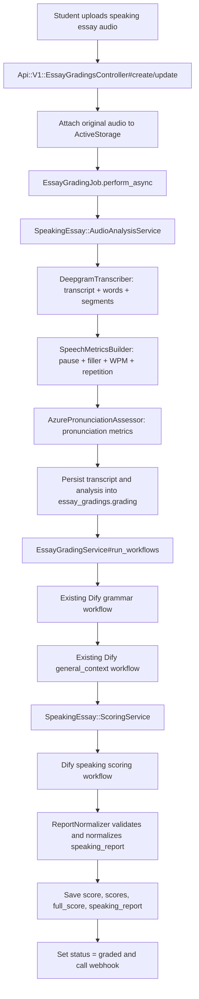

# Speaking Essay Backend Handoff and Deployment Guide

這份文檔是給 backend 工程師 merge 和部署 `speaking_essay` 新評分流程用的。重點是：

- 原本的 grammar workflow 保留。
- 原本的 general context workflow 保留。
- 新增 Deepgram transcript / speech metrics。
- 新增 Azure Pronunciation Assessment。
- 新增 Dify speaking scoring workflow。
- OpenAI 評分不由 Rails backend 直接 call，而是在 Dify Workflow 裡執行。
- Rails backend 不再依賴 ffmpeg 做 production scoring 的核心流程。

## 1. 最終目標

Speaking Essay 學生上傳音頻後，backend 要產出一份前端可直接讀取的 speaking score report。

前端讀：

```http
GET /api/v1/essay_gradings/:id.json
```

需要可取得：

- `essay_grading.score`
- `essay_grading.overall_score`
- `essay_grading.full_score`
- `essay_grading.scores`
- `essay_grading.grading.speaking_report`
- `essay_grading.grading.transcript`
- `essay_grading.grading.speech_metrics`
- `essay_grading.grading.pronunciation_metrics`
- 原本 `essay_grading.grading.data.text`
- 原本 `essay_grading.general_context.data.text`

## 2. 現在的完整流程



## 3. 第一階段和第二階段對應

### 第一階段

如果只要最低可用版本：

```text
audio -> Dify audio-to-text -> Dify scoring
```

目前這個 branch 實作的是更完整的第二階段架構，但仍然保留 Dify scoring 的中心位置。

### 第二階段

目前 backend 實作：

```text
audio -> Deepgram transcript
      -> backend speech metrics
      -> Azure pronunciation metrics
      -> existing Dify grammar workflow
      -> existing Dify general context workflow
      -> Dify speaking scoring workflow
      -> save speaking_report
```

Deepgram 和 Azure 都會回傳 JSON；backend 會把整理後的 JSON 傳入 Dify prompt，讓 Dify scoring 可以根據 transcript、pause、filler、WPM、pronunciation 等 evidence 出分。

## 4. 與舊流程的關係

舊流程仍在 `EssayGradingService#run_workflows`：

1. `grading` workflow 照舊 call。
2. `general_context` workflow 照舊 call。
3. `revised_essay` workflow 如有 app key 仍照舊 call。
4. 只有 `speaking_essay` 並且以上 core workflows 成功後，才新增 call `SpeakingEssay::ScoringService`。

因此這次不是替換原本 Dify prompt，而是額外接一條 speaking scoring workflow。

## 5. 主要修改文件

### Controller

`app/controllers/api/v1/essay_gradings_controller.rb`

責任：

- `create` 時 speaking essay 先建立 grading，再 attach 原始音頻。
- `update` 時如果從 draft 變成 pending，或重新上傳音頻，才 enqueue job。
- speaking essay 不再用 `SpeakingAudioAttachmentNormalizerService` 轉 MP3。
- 非 draft speaking essay 如果沒有音頻，直接回 `422`。
- show API 回傳 speaking score:
  - `score`
  - `overall_score`
  - `full_score`
  - `scores`
  - `grading.speaking_report`

### Model

`app/models/essay_grading.rb`

責任：

- speaking essay 不再由 model `after_create/after_update` 立即 enqueue。
- 原因：ActiveStorage attachment 在 controller transaction 之後才可靠；如果 model callback 太早 enqueue，worker 可能找不到音頻。
- `run_workflow_sync` 對 speaking essay 會先跑 audio analysis，再跑舊 Dify workflows。
- webhook payload 支援 speaking essay score breakdown。

### Job

`app/sidekiq/essay_grading_job.rb`

責任：

- 非 speaking essay：維持原本 `transcribe_audio` + `EssayGradingService`。
- speaking essay：
  1. 跑 `SpeakingEssay::AudioAnalysisService`
  2. reload grading
  3. 跑 `EssayGradingService`
- Deepgram/Azure 階段如果失敗，讓 Sidekiq retry。
- Sidekiq retry 耗盡後，才把 grading 標成 `stopped` 並寄 admin notification。

### Audio analysis services

`app/services/speaking_essay/audio_analysis_service.rb`

責任：

- 從 ActiveStorage blob download 到 tempfile。
- 保留原始 content type，例如 `audio/webm`, `audio/mpeg`, `audio/mp4`, `audio/wav`。
- call Deepgram。
- call SpeechMetricsBuilder。
- call Azure Pronunciation Assessment。
- 寫入 transcript / analysis 到 `essay_gradings.grading`。

`app/services/speaking_essay/deepgram_transcriber.rb`

責任：

- POST audio binary 到 Deepgram:

```text
https://api.deepgram.com/v1/listen
```

- 使用 query params:
  - `model`
  - `language`
  - `smart_format=true`
  - `punctuate=true`
  - `utterances=true`
  - `filler_words=true`

回傳整理後：

- `transcript_text`
- `confidence`
- `words`
- `segments`
- `raw_provider_payload`，預設不保存到 DB，除非 env 開啟。

`app/services/speaking_essay/speech_metrics_builder.rb`

責任：

- 根據 Deepgram word timestamps 計算：
  - total words
  - duration
  - WPM
  - filler count
  - filler terms
  - repeated terms
  - pause count
  - pause ranges
  - segments

`app/services/speaking_essay/azure_pronunciation_assessor.rb`

責任：

- 執行 Python helper script。
- 傳入 audio path 和 Deepgram transcript 作為 reference text。
- normalize Azure result 成：
  - overall band
  - raw pronunciation score
  - accuracy
  - fluency
  - prosody
  - completeness
  - word level feedback

`script/azure_pronunciation_continuous.py`

責任：

- 使用 `azure-cognitiveservices-speech` SDK。
- continuous recognition。
- pronunciation assessment。
- aggregation segment-level scores。
- stdout 輸出 JSON 給 Ruby service parse。

### Dify speaking scoring services

`app/services/speaking_essay/scoring_service.rb`

責任：

- 從 `grading.speaking_analysis` 取 transcript / metrics。
- 組 Dify workflow inputs。
- call `DifyScoringClient`。
- call `ReportNormalizer`。
- 驗證 Dify output 必須有四項 IELTS score 和 overall score。
- 寫入：
  - `grading.speaking_report`
  - `grading.scores`
  - `grading.speaking_scores`
  - `grading.overall_score`
  - `grading.score`
  - `grading.full_score`
  - DB column `score`

`app/services/speaking_essay/dify_scoring_client.rb`

責任：

- POST 到 Dify workflow:

```text
{DIFY_WORKFLOW_BASE_URL}/workflows/run
```

- 預設 base URL:

```text
https://aienglish-dify.docai.net/v1
```

- response mode 使用 `blocking`。

`app/services/speaking_essay/report_normalizer.rb`

責任：

- normalize scores 到 0-9 IELTS band，0.5 increment。
- 保留 evidence / language analysis / coaching。
- speaking essay error category 僅允許：
  - `A`
  - `B`
  - `C`
- 如果 Dify 缺少必要 score，不會默默存成 0 分。

## 6. Dify input contract

Backend 固定傳以下 variables 到 Dify speaking scoring workflow：

```json
{
  "task_type": "IELTS Speaking Part 2",
  "prompt_title": "string",
  "cue_card": "string",
  "transcript_text": "string",
  "deepgram_json": "json string",
  "speech_metrics_json": "json string",
  "azure_pronunciation_json": "json string",
  "pronunciation_metrics_json": "json string",
  "heuristic_scores_json": "json string"
}
```

Dify workflow start node 必須使用完全相同的 variable names。

## 7. Dify output contract

Dify 必須回傳 JSON。可以放在 outputs 的 `speaking_report`, `result_json`, `text`, 或整個 outputs hash 裡。最穩定建議回：

```json
{
  "speaking_report": {
    "scores": {
      "fluency_and_coherence": 6.0,
      "lexical_resource": 6.0,
      "grammatical_range_and_accuracy": 5.5,
      "pronunciation": 6.5,
      "overall_band_score": 6.0
    },
    "evidence": {
      "fluency_and_coherence": ["string"],
      "lexical_resource": ["string"],
      "grammatical_range_and_accuracy": ["string"],
      "pronunciation": ["string"]
    },
    "language_analysis": {
      "topic_relevance": {
        "relevance_score": 6.0,
        "rationale": "string"
      },
      "grammar_summary": "string",
      "lexical_summary": "string",
      "sentence_level_feedback": [
        {
          "sentence": "string",
          "feedback": "string",
          "category": "A"
        }
      ],
      "rewrite_suggestions": [
        {
          "original": "string",
          "improved": "string"
        }
      ],
      "topical_strengths": ["string"]
    },
    "speech_metrics": {},
    "pronunciation_metrics": {},
    "coaching": ["string"]
  }
}
```

Required score keys:

- `fluency_and_coherence`
- `lexical_resource`
- `grammatical_range_and_accuracy`
- `pronunciation`
- `overall_band_score`

If any score key is missing, backend treats Dify scoring as failed.

## 8. DB persistence contract

No new database migration is required. Existing columns are used:

- `essay_gradings.essay`
- `essay_gradings.grading`
- `essay_gradings.general_context`
- `essay_gradings.score`
- `essay_gradings.status`

After audio analysis:

```json
{
  "speaking_analysis": {
    "transcript": {
      "text": "string",
      "segments": [],
      "words": [],
      "confidence": 0.0
    },
    "deepgram": {},
    "azure_pronunciation": {},
    "speech_metrics": {},
    "pronunciation_metrics": {}
  },
  "speaking_transcript": "string",
  "transcript": {},
  "speech_metrics": {},
  "pronunciation_metrics": {}
}
```

After Dify speaking scoring:

```json
{
  "speaking_report": {},
  "scores": {},
  "speaking_scores": {},
  "overall_score": 6.0,
  "score": 6.0,
  "full_score": 9
}
```

The old grammar workflow still writes to:

```json
{
  "data": {
    "text": "..."
  },
  "number_of_suggestion": 0
}
```

The old general context workflow still writes to:

```json
{
  "data": {
    "text": "..."
  }
}
```

## 9. Environment variables

Required:

```bash
DEEPGRAM_API_KEY=...
AZURE_SPEECH_KEY=...
AZURE_SPEECH_REGION=eastasia
AZURE_SPEECH_LOCALE=en-US
DIFY_SPEAKING_ESSAY_SCORING_APP_KEY=app-...
DIFY_WORKFLOW_BASE_URL=https://aienglish-dify.docai.net/v1
```

Optional:

```bash
DEEPGRAM_MODEL=nova-3
ASR_LANGUAGE=en
SPEAKING_ESSAY_SCORING_TIMEOUT_SECONDS=180
SPEAKING_ESSAY_PAUSE_SECONDS=1.0
AZURE_SPEECH_PYTHON_BIN=python3
AZURE_SPEECH_TIMEOUT_SECONDS=180
SPEAKING_ESSAY_STORE_RAW_PROVIDER_PAYLOADS=false
```

Key selection:

1. If assignment rubric has `rubric.app_key.speaking_scoring`, backend uses that first.
2. Else backend uses `DIFY_SPEAKING_ESSAY_SCORING_APP_KEY`.
3. Else backend checks fallback `DIFY_SPEAKING_ESSAY_APP_KEY`.

Do not commit real provider keys.

## 10. Server dependencies

Ruby side uses existing gems:

- `rest-client`
- `json`
- `open3`
- ActiveStorage
- Sidekiq

Python side needs:

```bash
pip install azure-cognitiveservices-speech
```

Recommended production check:

```bash
python3 -c "import azure.cognitiveservices.speech as speechsdk; print('azure speech ok')"
```

If using a custom Python path:

```bash
AZURE_SPEECH_PYTHON_BIN=/path/to/python3
```

## 11. Audio format strategy

Backend now stores original uploaded audio. It does not transcode in the request path.

Preferred upload formats:

- `audio/webm`
- `audio/mpeg` / `.mp3`
- `audio/mp4` / `.m4a`
- `audio/wav`

Deepgram can receive common browser audio directly.

Azure Speech SDK support depends on server image codecs. For production:

- Best: upload or generate `wav`/`mp3` that Azure SDK can read.
- Acceptable: keep webm/m4a if the production image can decode it.
- Avoid: Rails web server using ffmpeg-static as a required scoring step.
- If conversion is unavoidable, do it in a dedicated worker image with explicit ffmpeg/GStreamer dependencies.

## 12. Failure and retry behavior

### Missing audio

Non-draft speaking essay submission without audio returns `422`.

### Deepgram or Azure failure

The job raises the error so Sidekiq can retry.

When retries are exhausted:

- `essay_grading.status = stopped`
- admin notification is sent

### Old grammar/general context failure

Existing behavior remains:

- if grammar workflow fails, status becomes `stopped`
- if general context app key exists and workflow fails, status becomes `stopped`
- admin notification is sent

### Dify speaking scoring failure

If Dify fails, returns invalid JSON, or misses required score keys:

- scoring service returns false
- `EssayGradingService` marks status `stopped`
- admin notification is sent

## 13. Frontend response shape

The frontend should continue using:

```http
GET /api/v1/essay_gradings/:id.json
```

For speaking essay, response includes:

```json
{
  "essay_grading": {
    "score": 6.0,
    "overall_score": 6.0,
    "full_score": 9,
    "scores": {
      "fluency_and_coherence": 6.0,
      "lexical_resource": 6.0,
      "grammatical_range_and_accuracy": 5.5,
      "pronunciation": 6.5,
      "overall_band_score": 6.0
    },
    "essay": "transcript text",
    "grading": {
      "speaking_report": {},
      "transcript": {},
      "speech_metrics": {},
      "pronunciation_metrics": {},
      "data": {
        "text": "old grammar JSON string"
      }
    },
    "general_context": {
      "data": {
        "text": "old general context JSON string"
      }
    }
  }
}
```

## 14. QA checklist

Before production deploy:

1. Confirm branch is `bobby-codex-backend`.
2. Confirm real keys exist in server env.
3. Confirm no real keys are committed.
4. Confirm Python package installed on worker host.
5. Confirm Sidekiq worker can access ActiveStorage blobs.
6. Create a speaking essay assignment.
7. Upload a short `webm` audio from browser.
8. Check Sidekiq logs:
   - Deepgram request success
   - Azure script success
   - old grammar workflow success
   - old general context workflow success
   - speaking scoring workflow success
9. Check DB:
   - `essay_gradings.essay` contains transcript
   - `grading.speaking_analysis` exists
   - `grading.speaking_report` exists
   - `score` is non-null
   - `status = graded`
10. Check frontend grading page:
    - left transcript block has transcript/pauses/filters
    - right Score tab shows speaking score
    - Grammar tab still shows old grammar result
    - General Context tab still shows old general context result

## 15. Local validation commands

Syntax checks:

```bash
ruby -c app/controllers/api/v1/essay_gradings_controller.rb
ruby -c app/models/essay_grading.rb
ruby -c app/services/essay_grading_service.rb
ruby -c app/sidekiq/essay_grading_job.rb
for f in app/services/speaking_essay/*.rb; do ruby -c "$f" || exit 1; done
python3 -m py_compile script/azure_pronunciation_continuous.py
git diff --check
```

Small service smoke test:

```bash
RBENV_VERSION=3.1.0 /Users/bobbylian/.rbenv/bin/rbenv exec ruby -Iapp/services -e "require 'logger'; require 'active_support/all'; require './app/services/speaking_essay/speech_metrics_builder'; require './app/services/speaking_essay/report_normalizer'; raise unless SpeakingEssay::SpeechMetricsBuilder.new.call(deepgram_result: {words: [{token: 'um', start: 0, end: 0.2}, {token: 'hello', start: 1.5, end: 2.0}], segments: []})[:pause_count] == 1; raise unless SpeakingEssay::ReportNormalizer.new.call(report: {'scores'=>{'fluency_and_coherence'=>6,'lexical_resource'=>6,'grammatical_range_and_accuracy'=>5.5,'pronunciation'=>7}}, speech_metrics: {}, pronunciation_metrics: {})['scores']['overall_band_score'] == 6.0; puts 'smoke ok'"
```

Full Rails runner may require correct local Postgres SSL settings.

## 16. Troubleshooting

### Status becomes stopped before grammar/general context

Likely failure in:

- missing audio
- Deepgram API key
- Deepgram file/content type
- Azure key/region
- Azure Python dependency
- Azure cannot decode audio format

Check Sidekiq logs for `[EssayGradingJob] Speaking essay audio analysis failed`.

### Status becomes stopped after grammar/general context

Likely failure in:

- Dify speaking scoring app key
- Dify workflow input names mismatch
- Dify invalid JSON output
- missing required score keys

Check logs for `[SpeakingEssay::ScoringService]`.

### Frontend score tab is empty

Check API response has:

- `essay_grading.scores`
- `essay_grading.grading.speaking_report.scores`
- `essay_grading.score`
- `essay_grading.full_score`

### Transcript appears but no pronunciation

Deepgram succeeded, Azure failed. Check:

- `AZURE_SPEECH_KEY`
- `AZURE_SPEECH_REGION`
- Python dependency
- audio codec support
- `AZURE_SPEECH_LOCALE`

### Dify returns markdown instead of JSON

Update Dify prompt to say:

```text
Return valid JSON only. Do not include markdown. Do not include explanation outside the JSON.
```

Backend strips simple fenced code blocks, but the safest fix is to enforce JSON in Dify.

## 17. Rollback plan

Fast rollback:

1. Revert this branch commit.
2. Redeploy worker/web.
3. Existing grammar/general context flows will return to previous behavior.

Partial rollback:

- Remove `DIFY_SPEAKING_ESSAY_SCORING_APP_KEY` to prevent new speaking scoring from succeeding.
- Existing grammar/general context may still run, but speaking essay final status can become `stopped` because speaking scoring is required in this branch.

Clean partial rollback would require code change to make speaking scoring optional.

## 18. Important implementation note

This branch intentionally makes speaking scoring required for `speaking_essay`. That matches the product requirement:

```text
audio -> Deepgram transcript
      -> Azure pronunciation metrics
      -> Dify scoring
```

If the business later wants fallback mode, add an env such as:

```bash
SPEAKING_ESSAY_REQUIRE_PROVIDER_SCORING=false
```

Then update `EssayGradingService#update_final_status` to allow old grammar/general context to grade even when speaking scoring fails.
